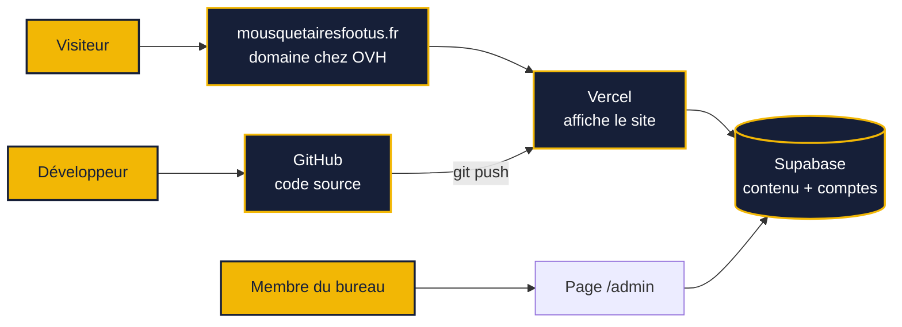
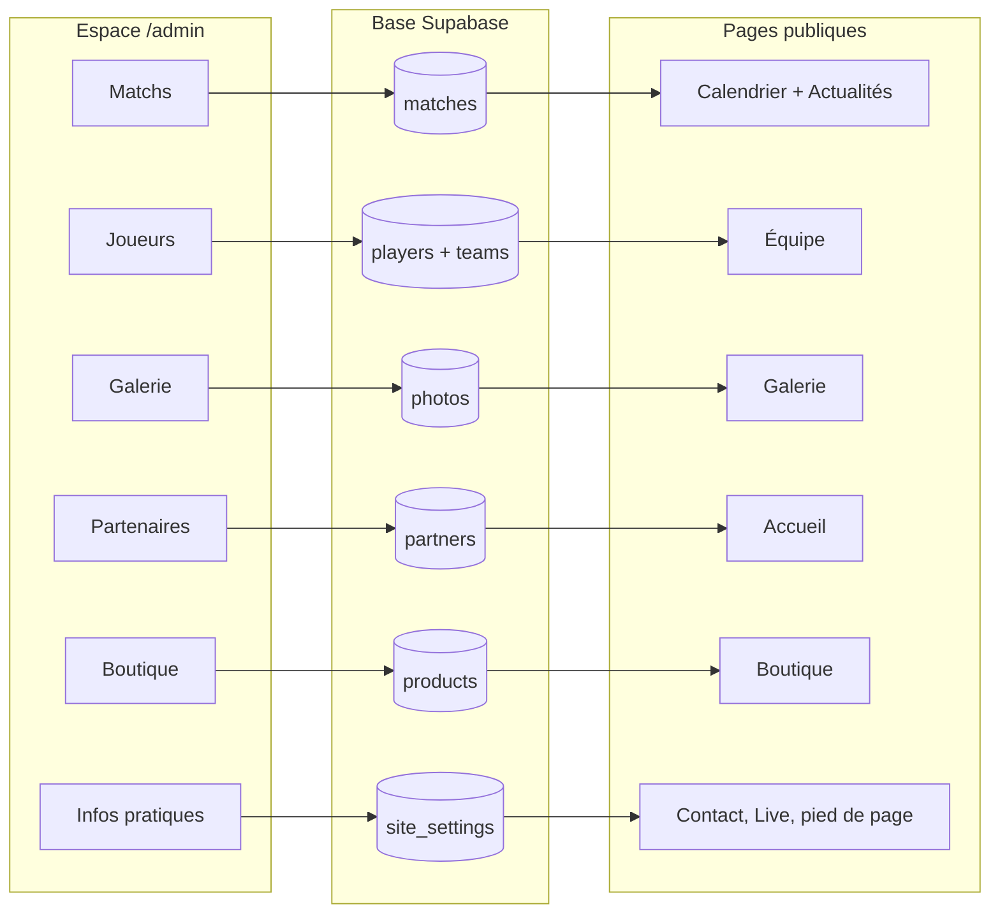
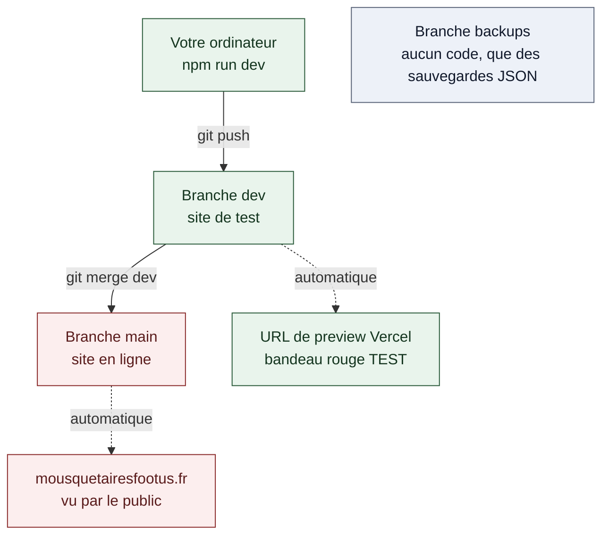
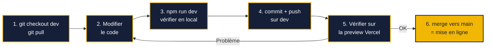
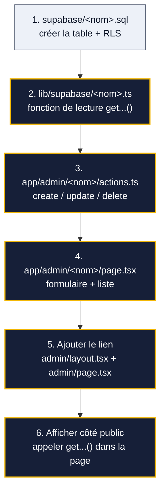
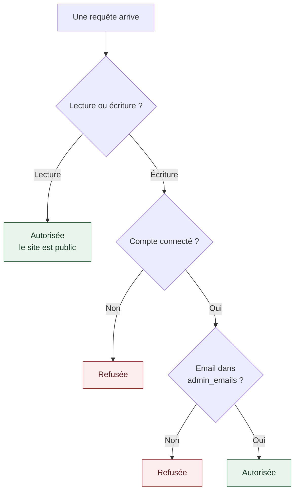

# Les Mousquetaires — site du club

Site officiel du club de football américain **Les Mousquetaires** (Châtenay-Malabry).

| | |
|---|---|
| **Site en ligne** | https://mousquetairesfootus.fr |
| **Espace de gestion** | https://mousquetairesfootus.fr/admin |
| **Guide non technique** | [`GUIDE-CLUB.md`](GUIDE-CLUB.md) — pour les membres du bureau qui gèrent le contenu |

---

## Vue d'ensemble

Quatre services séparés font tourner le site. Aucun n'est payant dans l'usage actuel.



**À retenir :** le contenu (résultats, photos, boutique…) ne vit pas dans le code. Il est dans la
base de données et se modifie depuis `/admin`, **sans toucher au code ni redéployer quoi que ce soit**.

---

## Démarrage rapide

Prérequis : [Node.js](https://nodejs.org) version 20 ou plus récente.

```bash
git clone git@github.com:SabakuMansa/Mouss.git
cd Mouss
npm install
```

Créez ensuite un fichier `.env.local` à la racine (il n'est **jamais** dans Git) :

```bash
NEXT_PUBLIC_SUPABASE_URL=https://pveiltpmlbvaddganotj.supabase.co
NEXT_PUBLIC_SUPABASE_ANON_KEY=<la clé publique du projet Supabase>
```

> Ces deux valeurs se trouvent dans **Supabase → Project Settings → API Keys**. Elles sont
> **publiques par conception** — n'importe quel visiteur peut déjà les lire dans son navigateur.
> La vraie sécurité est appliquée par la base de données (voir [Sécurité](#sécurité)).

Puis lancez le site :

```bash
npm run dev     # http://localhost:3000
```

Un bandeau rouge en bas à gauche confirme que vous êtes en local, jamais sur le vrai site.

---

## Organisation du projet

```
app/
  (site)/             → pages publiques, partagent menu + pied de page
    layout.tsx        → le menu et le pied de page communs
    page.tsx          → accueil
    calendrier/       → une page = un dossier, le nom du dossier fait l'URL
    live/             → page Twitch
    ...
  admin/              → espace privé, protégé par connexion
    <section>/page.tsx     → formulaire + liste
    <section>/actions.ts   → create / update / delete (code serveur)
  layout.tsx          → structure commune (polices, SEO, bandeau d'environnement)

proxy.ts              → bloque /admin/* si non connecté (renvoie vers la connexion)

components/           → composants réutilisables, rangés par thème
  home/  teams/  shop/  admin/  live/  ui/  layout/

lib/
  supabase/           → connexion à la base + lecture des données
    client.ts         → côté navigateur     server.ts → côté serveur
    matches.ts  roster.ts  photos.ts  partners.ts  products.ts  settings.ts
  data/               → contenu volontairement figé dans le code
                        (identité du club, mentions légales, valeurs, palmarès)
  types.ts            → définitions TypeScript
  utils.ts            → dates, statut de match…

supabase/             → scripts SQL, à exécuter dans Supabase → SQL Editor
scripts/backup.mjs    → export JSON de toutes les tables
.github/workflows/    → sauvegarde automatique du lundi
```

### Pourquoi certains contenus sont dans `lib/data/` et pas dans la base

C'est volontaire. Y restent les contenus qui **ne changent quasiment jamais** ou dont une faute de
frappe aurait des conséquences : identité du club, mentions légales (`club.ts`), valeurs, frise
historique, palmarès. Git en garde l'historique, ils ne sont pas modifiables par erreur depuis
l'admin.

---

## D'où vient chaque contenu du site



Les **actualités** de la page d'accueil ne se saisissent pas : ce sont les 3 derniers matchs joués,
reformulés automatiquement (`lib/data/news.ts`).

| Section admin | URL | Gère |
|---|---|---|
| Matchs & résultats | `/admin/matchs` | Calendrier de la saison |
| Joueurs & staff | `/admin/joueurs` | Effectif Séniors, U18, coachs |
| Galerie | `/admin/galerie` | Photos |
| Partenaires | `/admin/partenaires` | Sponsors |
| Boutique | `/admin/boutique` | Articles et photos |
| Infos pratiques | `/admin/infos` | Adresse, horaires, réseaux, carte, chaîne Twitch |

---

## Branches et environnements



- **`dev`** — branche de travail. Chaque `git push` génère une URL de preview Vercel avec un
  bandeau rouge « Test ». Rien de ce qui s'y trouve n'est visible du public.
- **`main`** — le vrai site. Tout ce qui arrive ici part **immédiatement en ligne**.
- **`backups`** — ne contient aucun code, seulement l'historique des sauvegardes. Vercel tente de la
  déployer et échoue : c'est normal et sans conséquence.

> ⚠️ **Ne jamais utiliser le bouton « Redeploy »** sur un déploiement `dev` en cochant une option liée
> à la production : cela mettrait en ligne du code non validé. Pour republier `dev`, faites un
> nouveau `git push`.

---

## Faire une mise à jour



```bash
# 1 à 4
git checkout dev && git pull
# ... vos modifications ...
npm run dev                        # vérifier sur http://localhost:3000
git add -A
git commit -m "Description du changement"
git push origin dev

# 6 — seulement une fois la preview validée
git checkout main
git pull
git merge dev
git push origin main               # Vercel met le vrai site à jour tout seul
```

---

## Ajouter une nouvelle page publique

1. Créez un dossier dans `app/(site)/` portant le nom de l'URL voulue
   (`app/(site)/evenements/` → `/evenements`)
2. Dedans, un fichier `page.tsx` — partez d'une page existante similaire, par exemple
   [`app/(site)/galerie/page.tsx`](app/\(site\)/galerie/page.tsx)
3. Ajoutez l'entrée de menu dans `lib/data/club.ts`, tableau `navLinks`

---

## Ajouter une section à l'espace admin

Les 6 sections existantes suivent **exactement le même schéma**. En comprendre une, c'est les
comprendre toutes. `partenaires` est la plus simple à copier.



Fichiers à prendre comme modèles :
[`supabase/migrate_products.sql`](supabase/migrate_products.sql) ·
[`lib/supabase/partners.ts`](lib/supabase/partners.ts) ·
[`app/admin/partenaires/actions.ts`](app/admin/partenaires/actions.ts)

---

## Sécurité



Ces règles sont appliquées **par la base de données elle-même** (Row Level Security), pas par le
code du site. Même un bug dans le code ne peut pas les contourner.

- **Aucune inscription publique.** Les comptes sont créés à la main dans
  Supabase → Authentication → Users.
- **Liste blanche d'admins.** Un compte connecté ne peut écrire que si son email figure dans la
  table `admin_emails`. Voir [`supabase/harden_admin_access.sql`](supabase/harden_admin_access.sql).
- **Aucun secret dans Git.** `.env.local` est exclu par `.gitignore`.

### Ajouter un administrateur

Deux étapes, les deux obligatoires :

1. **Supabase → Authentication → Users → Add user**, en cochant **Auto Confirm User**
2. **SQL Editor** :
   ```sql
   insert into admin_emails (email) values ('son-email@exemple.com');
   ```

Sans la seconde, la personne peut se connecter mais ne peut rien modifier.

### Alertes de sécurité

Supabase envoie un email si une table est créée **sans RLS activé**. **Ne jamais ignorer ces
emails** — ils sont fiables. Réflexe :

```sql
alter table <nom_de_la_table> enable row level security;
-- puis les règles de lecture/écriture, voir schema.sql comme modèle
```

Un oubli de ce type sur `admin_emails` a été détecté et corrigé le 2026-08-03
([`supabase/fix_admin_emails_rls.sql`](supabase/fix_admin_emails_rls.sql)).

---

## Sauvegardes

Une [GitHub Action](.github/workflows/backup.yml) exporte toutes les tables en JSON **chaque lundi
à 3h** sur la branche `backups`, dossier `backups/<date>/`. Gratuit, aucune intervention nécessaire.

- **Sauvegarde manuelle immédiate :** GitHub → onglet **Actions** → « Sauvegarde hebdomadaire de la
  base de données » → **Run workflow**
- **Restaurer :** ouvrez le fichier JSON sur la branche `backups`, réinjectez les lignes via
  Supabase → Table Editor ou SQL Editor

---

## Revenir en arrière

**Le plus simple — sans toucher au code.** Vercel garde tous les déploiements précédents :
vercel.com → **Deployments** → un déploiement `main` qui fonctionnait → **« … »** →
**Promote to Production**. Retour instantané.

**Avec Git**, pour annuler aussi le changement dans le code :

```bash
git log --oneline          # repérer l'identifiant du commit fautif
git revert <identifiant>   # crée un commit qui annule proprement le précédent
git push origin main
```

> Évitez `git reset --hard` sur une branche partagée : `git revert` est plus sûr, il corrige sans
> réécrire l'historique.

---

## Pièges connus

Les points qui ont réellement fait perdre du temps sur ce projet. À lire avant de chercher longtemps.

### `transform` ne s'affiche pas — utilisez `scale`

Sur les boutons et liens de ce projet, la propriété CSS `transform` **n'a aucun effet visible**
(elle est calculée à `none`), alors que la propriété indépendante `scale` fonctionne normalement.

Conséquence : toute animation d'appui ou de survol basée sur `transform` — y compris le `whileTap`
de Framer Motion — reste **invisible sans provoquer la moindre erreur**. Utilisez les utilitaires
Tailwind `active:scale-*` / `hover:scale-*`, qui compilent bien vers `scale`.

### `transition-all` écrase l'effet d'appui

`transition-all` lisse aussi le `scale` sur 300 ms, ce qui rend le retour au clic imperceptible.
Listez explicitement les propriétés animées en excluant `scale`, comme dans
[`components/ui/Button.tsx`](components/ui/Button.tsx).

### Un composant serveur ne peut pas recevoir d'icône dans un composant client

Passer une icône `lucide-react` en prop (`icon={ExternalLink}`) depuis une page serveur vers un
composant marqué `"use client"` provoque une **erreur serveur en production** :
*« Functions cannot be passed directly to Client Components »*. `Button` doit donc rester un
composant serveur. Isolez l'interactivité dans un composant enfant qui reçoit du contenu **déjà
rendu**, jamais une référence de composant.

### Les builds utilisent `--webpack`

```bash
npm run build -- --webpack
```

Héritage d'une incompatibilité entre Turbopack et un lien symbolique `node_modules` de l'ancienne
installation. Le projet ayant depuis changé d'emplacement, **cette contrainte n'a jamais été
revérifiée** — le build par défaut fonctionne peut-être très bien aujourd'hui.

### Les photos de la boutique pointent vers HelloAsso

Les images des 17 articles sont **hébergées chez HelloAsso**
(`cdn.helloasso.com`, autorisé dans `next.config.ts`). Leur page boutique bloque les robots (403),
mais leur serveur d'images, lui, est accessible. Si HelloAsso change ces adresses, les photos
disparaîtront : il faudra alors les ré-héberger via `/admin/boutique`.

### La base de données est unique

Il n'y a **qu'une seule base Supabase**, partagée par `dev` et `main`. Un script SQL exécuté depuis
l'environnement de test affecte donc **aussi le site en ligne**. Il n'y a pas de base de test séparée.

---

## Qualité du code

```bash
npm run lint                 # ESLint
npx tsc --noEmit             # vérification TypeScript seule
npm run build -- --webpack   # build complet (inclut les deux)
```

TypeScript est en mode `strict`. Il n'y a **aucun test automatisé** : toute modification doit être
vérifiée visuellement en local puis sur la preview `dev`.

---

## Documents liés

| Fichier | Pour qui |
|---|---|
| `README.md` | Développeurs — ce document |
| [`GUIDE-CLUB.md`](GUIDE-CLUB.md) | Membres du bureau — utilisation quotidienne de `/admin` |
